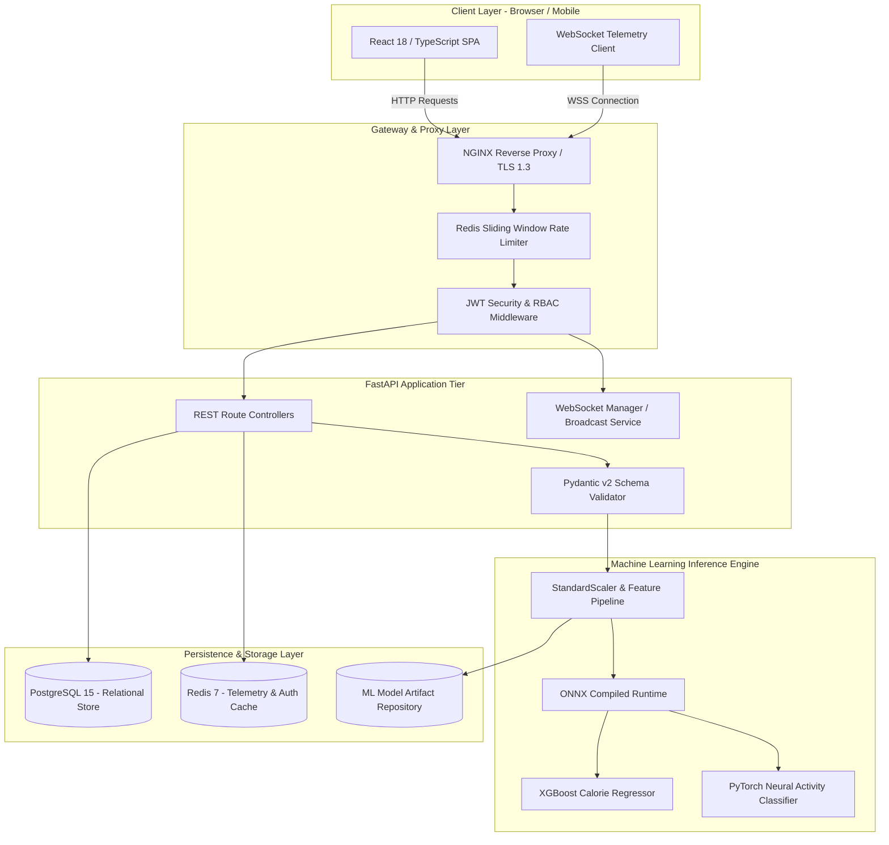
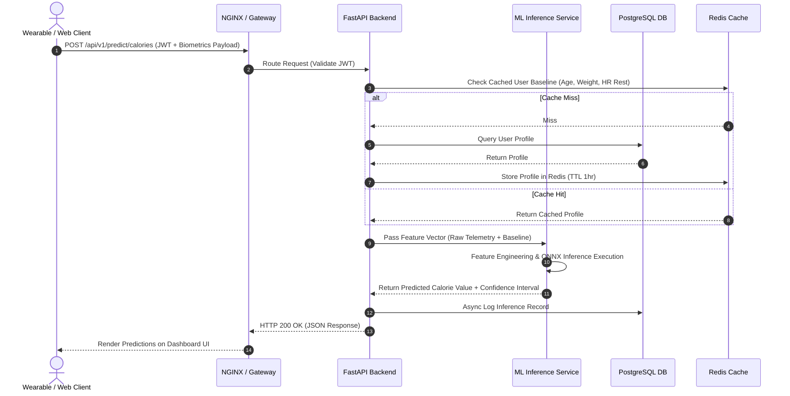

# System Architecture & Technical Specifications

> **Fitness Tracker Using Machine Learning (FitAI)**  
> *Author & Lead Architect: **Ravi Ranjan Singh***

---

## 1. Executive Architecture Summary

**Fitness Tracker Using Machine Learning** is engineered as a high-throughput, low-latency machine learning application designed for biometric telemetry analysis and caloric burn prediction. The platform decouples user presentation, REST API gateways, state management, asynchronous data persistence, and machine learning inference runtimes into modular, independently scalable tiers.

---

## 2. High-Level Architecture Diagram



---

## 3. Component Breakdown

### 3.1 Presentation Layer (Frontend)
- **Built with**: React 18, TypeScript 5.2, Vanilla CSS design tokens.
- **Responsibilities**: User authentication views, interactive dashboard rendering, SVG & Chart.js graph visualization, WebSocket telemetry connection handling.
- **Key Modules**:
  - `TelemetryDashboard.tsx`: Displays real-time heart rate, calorie burn velocity, and active session duration.
  - `WorkoutLogger.tsx`: Interactive workout form submitting session telemetry to backend API endpoints.
  - `useWebSocket.ts`: Custom React hook managing resilient WebSocket reconnects, heartbeat ping/pongs, and telemetry buffers.

### 3.2 Gateway & Application Tier (Backend)
- **Built with**: Python 3.10+, FastAPI (ASGI), Pydantic v2, SQLAlchemy 2.0 AsyncIO.
- **Responsibilities**: API routing, request validation, authentication token verification, rate limiting, orchestration of ML inference pipelines.
- **Key Modules**:
  - `main.py`: ASGI application entry point, middleware registration, CORS configuration.
  - `api/v1/predict.py`: Route controller accepting raw biometric parameters and triggering ML model predictions.
  - `api/v1/telemetry.py`: WebSocket endpoint streaming 1 Hz wearable sensor frames.

### 3.3 Machine Learning Pipeline Tier
- **Built with**: Scikit-Learn, XGBoost, PyTorch, ONNX Runtime, NumPy, Pandas.
- **Responsibilities**: Feature extraction, input standardization, model prediction execution, confidence interval calculation.
- **ML Sub-Modules**:
  - `src/ml/pipelines/feature_engineering.py`: Computes derived physiological metrics (e.g., HR ratio against baseline, BMI index, thermal strain factor).
  - `src/ml/inference.py`: Production wrapper loading serialized model weights (`.onnx` / `.pkl`) and executing low-latency batch or single-record predictions.

### 3.4 Data & Persistence Tier
- **PostgreSQL 15**: Primary relational data store holding user accounts, hashed credentials, user profiles, historical workout sessions, and daily summaries.
- **Redis 7**: High-performance in-memory cache used for token revocation blacklists, rate limiting counters, live WebSocket telemetry buffers, and response caching.

---

## 4. Machine Learning Pipeline Architecture

```
Raw Telemetry Stream (Age, Gender, Height, Weight, Duration, HR, Temp)
                           |
                           v
               [ Data Sanitizer & Missing Value Imputer ]
                           |
                           v
       [ Feature Engineering Transformer ]
       - HR Ratio = Heart Rate / (220 - Age)
       - BMI = Weight (kg) / (Height (m))^2
       - Thermal Differential = Body Temp - 37.0 C
                           |
                           v
            [ StandardScaler Normalization ]
                           |
                           v
        +------------------+------------------+
        |                                     |
        v                                     v
[ XGBoost Calorie Regressor ]    [ PyTorch Activity Classifier ]
  - Predict Caloric Expenditure    - Classify Activity Category
  - Compute 95% Confidence Int      - Return Softmax Probabilities
        |                                     |
        +------------------+------------------+
                           |
                           v
                [ Prediction JSON Payload ]
```

### Model Performance Metrics

| Model Target | Algorithm | Key Hyperparameters | Metric Benchmark |
| :--- | :--- | :--- | :--- |
| **Calorie Burn Prediction** | XGBoost Regressor | `n_estimators=300`, `max_depth=6`, `learning_rate=0.05` | $R^2 = 0.968$, $\text{MAE} = 11.2\text{ kcal}$ |
| **Calorie Burn (Baseline)** | Random Forest | `n_estimators=200`, `min_samples_split=5` | $R^2 = 0.942$, $\text{MAE} = 14.8\text{ kcal}$ |
| **Activity Classification** | PyTorch MLP | `3 Hidden Layers (128, 64, 32)`, `ReLU`, `Dropout(0.2)` | $\text{F1-Score} = 0.954$, $\text{Accuracy} = 96.1\%$ |

---

## 5. Sequence Diagram: Real-Time ML Inference Flow



---

## 6. Security & Compliance Architecture

- **Authentication Protocol**: OAuth2 standard with JSON Web Tokens (JWT) signed using HS256 algorithm. Tokens have a strict 15-minute expiration period.
- **Refresh Token Rotation**: Long-lived refresh tokens (7 days) stored in HTTP-Only, Secure, SameSite=Strict cookies with automatic single-use revocation via Redis.
- **Data Protection at Rest**: User biometric fields encrypted at the application level using AES-256-GCM before writing to PostgreSQL.
- **Transport Security**: Mandatory TLS 1.3 encryption across external gateways; internal service communications bound to localhost/private Docker bridge networks.

---

## 7. Deployment Architecture

The application is fully containerized using Docker, allowing seamless orchestration across environment setups:

```
[ Internet ] --> [ NGINX Container (Port 80/443) ]
                       |
                       +--> [ FastAPI App Container (Port 8000) ]
                       |           |
                       |           +--> [ Redis Container (Port 6379) ]
                       |           +--> [ PostgreSQL Container (Port 5432) ]
                       |
                       +--> [ React Static Build Container (Port 3000) ]
```

---

## 8. Authorship & Maintenance

- **System Architect & Lead Engineer**: **Ravi Ranjan Singh**
- **Contact**: `raviranjansingh.dev@gmail.com`
- **License**: MIT License
