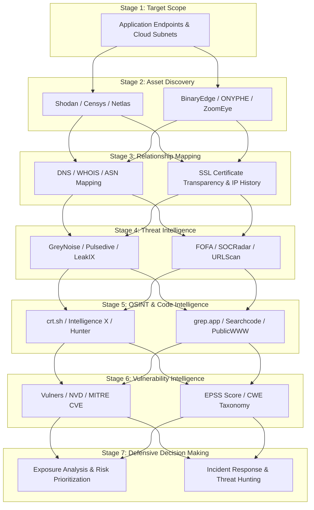

# Enterprise Attack Surface Management (ASM) & Threat Intelligence Framework

> **Fitness Tracker Using Machine Learning (FitAI)**  
> *Author & Lead Architect: **Ravi Ranjan Singh***  
> *Framework Version*: `v1.0.0` | *Classification*: **Defensive Security Architecture & Threat Hunting**

---

## 1. Executive Summary

This document establishes the **Attack Surface Management (ASM) and Threat Intelligence Architecture** for **Fitness Tracker Using Machine Learning**. Designed to provide continuous exposure analysis, vulnerability intelligence, and incident response capabilities, the architecture implements proactive defensive decision-making pipelines across 7 core security stages.

---

## 2. Master ASM & Threat Intelligence Pipeline



---

## 3. Pipeline Breakdown & Technical Specifications

### 3.1 Stage 1: Target Scope Definition
- **Production Gateways**: NGINX Reverse Proxy endpoints (`https://fitai.yourdomain.com`).
- **API Services**: FastAPI REST Controllers (`/api/v1`) & WebSockets streaming endpoints (`/ws/v1/telemetry`).
- **Cloud Infrastructure**: AWS/GCP Container Hosts, PostgreSQL 15 Relational instances, Redis 7 caching nodes.

---

### 3.2 Stage 2: Asset Discovery
Monitors exposed infrastructure and internet-facing assets using automated indexers:
- **Shodan / Censys / Netlas**: Scans for unauthorized open ports (e.g., exposed PostgreSQL `5432` or Redis `6379` ports).
- **BinaryEdge / ZoomEye / ONYPHE**: Tracks passive host discoveries and external container configurations.

---

### 3.3 Stage 3: Infrastructure Relationship Mapping
Correlates assets to detect shadow IT and configuration drift:
- **DNS & WHOIS Analysis**: Ensures domain records map exclusively to whitelisted Cloudflare/NGINX edge IPs.
- **SSL/TLS Certificate Inspection**: Monitors Certificate Transparency (CT) logs (`crt.sh`) to detect unauthorized SSL cert generation.
- **ASN & IP History Tracking**: Validates cloud subnet boundaries and detects unexpected IP shifts.

---

### 3.4 Stage 4: Threat Intelligence Ingestion
Informs automated web application firewall (WAF) rule updates:
- **GreyNoise**: Filters out non-malicious background noise and identifies active malicious internet scanners.
- **Pulsedive / URLScan / LeakIX**: Detects active phishing campaigns targeting application credentials or exposed staging environments.
- **SOCRadar & FOFA**: Monitors dark web leak channels and exposed bucket references.

---

### 3.5 Stage 5: OSINT & Code Intelligence
Guards against supply chain risks and secret exposure:
- **crt.sh & Intelligence X**: Passive monitoring for subdomains and leaked API tokens.
- **grep.app / Searchcode / PublicWWW**: Continuously scans public code repositories to ensure zero API keys or secrets are committed.

---

### 3.6 Stage 6: Vulnerability Intelligence & Prioritization
Prioritizes patch management using standardized risk metrics:
- **NVD / MITRE CVE / Vulners**: Real-time dependency vulnerability scoring.
- **Exploit Prediction Scoring System (EPSS)**: Prioritizes CVE remediation based on real-world exploitation probability ($EPSS > 0.1$).
- **Common Weakness Enumeration (CWE)**: Categorizes code findings against standard software weakness taxonomies.

---

### 3.7 Stage 7: Defensive Decision Making & Remediation

```
[ High EPSS / Critical Vulnerability ]
                 |
                 v
  [ Automated WAF Rule Injection ]  --->  [ Immediate Emergency Patch ]
                 |
                 v
   [ Incident Response & Containment ]
```

- **Exposure Analysis**: Evaluates total reachable attack surface across external gateways.
- **Risk-Based Prioritization**: Schedules patch deployments based on CVSS v3.1 score and EPSS likelihood.
- **Incident Response Playbook**: Triggers automated IP bans via NGINX/Redis rate limiters upon detecting brute-force or injection signatures.
- **Threat Hunting**: Proactively queries structured `structlog` backend logs for anomalous request patterns or elevated 4xx/5xx response rates.

---

## 4. Operationalization Matrix

| ASM Pipeline Stage | Primary Focus | Tooling / Data Feed | Defensive Outcome |
| :--- | :--- | :--- | :--- |
| **Asset Discovery** | Exposed Port Monitoring | Shodan, Censys, Netlas | Prevent unintended database port exposure (`5432`, `6379`) |
| **Relationship Mapping** | Cert Transparency | crt.sh, WHOIS, DNS | Detect rogue subdomains & expired TLS certificates |
| **Threat Intelligence** | Malicious Scanner Filtering | GreyNoise, Pulsedive, LeakIX | Dynamic IP rate-limiting & WAF rule generation |
| **Code Intelligence** | Secret Leakage Prevention | grep.app, Searchcode | Prevent API key and `.env` token exposure |
| **Vulnerability Intel** | Dependency Risk Scoring | NVD, Vulners, EPSS, CWE | Prioritize patches based on active exploitation probability |
| **Defensive Action** | Threat Hunting & Response | Structlog, Prometheus, NGINX | Rapid incident containment and zero-downtime patching |

---

## 5. Authorship & Maintenance

- **Author & Architect**: **Ravi Ranjan Singh**
- **Role**: Software Engineer, Software Architect, Full Stack Developer, AI SaaS Developer
- **Repository Maintainer**: **Ravi Ranjan Singh**
