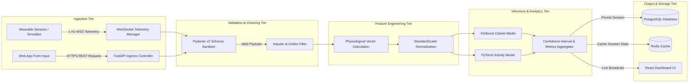

# Data Flow & Telemetry Ingestion Architecture

> **Fitness Tracker Using Machine Learning (FitAI)**  
> *Author & Lead Architect: **Ravi Ranjan Singh***

---

## 1. Executive Summary
This document provides an exhaustive specification of data movement, telemetry ingestion pipelines, machine learning feature transformations, persistence strategies, and real-time streaming workflows within the **Fitness Tracker Using Machine Learning** system.

---

## 2. End-to-End Data Pipeline Architecture



---

## 3. Data Schema & Ingress Specifications

### 3.1 Raw Biometric Telemetry Input Payload
When biometrics are transmitted via REST API or WebSocket connections, payloads must conform to the following specification:

```json
{
  "user_id": "usr_98a72f1b-4c01-4b11-9a7e-123456789abc",
  "timestamp": 1785537630,
  "age": 28,
  "gender": "male",
  "height_cm": 178.0,
  "weight_kg": 75.5,
  "duration_min": 45.0,
  "heart_rate_bpm": 154.5,
  "body_temp_c": 38.1,
  "accel_x": 0.12,
  "accel_y": 0.85,
  "accel_z": 9.78
}
```

### 3.2 Field Validation Rules

| Attribute | Data Type | Valid Range | Unit | Description |
| :--- | :--- | :--- | :--- | :--- |
| `user_id` | UUIDv4 String | Exact 36 chars | N/A | Unique identifier for authenticated user |
| `age` | Integer | $10 \le \text{age} \le 100$ | Years | User chronological age |
| `gender` | Enum | `"male" \| "female"` | N/A | Biological gender for metabolic basal rate |
| `height_cm` | Float | $100.0 \le h \le 250.0$ | cm | User height |
| `weight_kg` | Float | $30.0 \le w \le 300.0$ | kg | User body mass |
| `duration_min` | Float | $0.1 \le d \le 1440.0$ | Minutes | Elapsed workout activity duration |
| `heart_rate_bpm` | Float | $30.0 \le \text{hr} \le 230.0$ | BPM | Instantaneous or average heart rate |
| `body_temp_c` | Float | $35.0 \le t \le 42.0$ | °C | Peripheral body temperature reading |

---

## 4. Feature Engineering Matrix

Raw telemetry inputs are transformed into a normalized feature vector $\vec{x} \in \mathbb{R}^n$ prior to model inference:

```math
\text{BMI} = \frac{\text{weight\_kg}}{\left(\frac{\text{height\_cm}}{100}\right)^2}
```

```math
\text{HR\_Ratio} = \frac{\text{heart\_rate\_bpm}}{220 - \text{age}}
```

```math
\text{Thermal\_Strain} = \text{body\_temp\_c} - 37.0
```

```math
\text{Caloric\_Intensity\_Factor} = \text{HR\_Ratio} \times \text{duration\_min} \times \text{BMI}
```

### Feature Dictionary

```python
# python representation of feature engineering transformer
def transform_features(raw_payload: dict) -> np.ndarray:
    bmi = raw_payload["weight_kg"] / ((raw_payload["height_cm"] / 100.0) ** 2)
    max_hr = 220.0 - raw_payload["age"]
    hr_ratio = raw_payload["heart_rate_bpm"] / max_hr
    thermal_strain = raw_payload["body_temp_c"] - 37.0
    gender_encoded = 1.0 if raw_payload["gender"] == "male" else 0.0
    
    feature_vector = np.array([
        raw_payload["age"],
        gender_encoded,
        raw_payload["height_cm"],
        raw_payload["weight_kg"],
        raw_payload["duration_min"],
        raw_payload["heart_rate_bpm"],
        raw_payload["body_temp_c"],
        bmi,
        hr_ratio,
        thermal_strain
    ], dtype=np.float32)
    
    return feature_vector
```

---

## 5. Inference & Analytics Data Pipeline

1. **Ingress Parsing**: FastAPI handles incoming JSON via Pydantic schema `BiometricInferenceSchema`.
2. **Transform Execution**: Feature transformer converts validated dict to NumPy feature array.
3. **Scaler Application**: Standardizes feature array using pre-computed training set mean ($\mu$) and standard deviation ($\sigma$).
4. **Model Predict**:
   - `XGBoost Calorie Model` evaluates $\hat{y}_{\text{calories}} = f(\vec{x})$.
   - `PyTorch Activity Model` computes softmax probability vector $\vec{P}_{\text{activity}}$.
5. **Confidence Interval Estimation**: Applies residual quantile bounds to generate 95% upper and lower prediction bounds:
   $$\hat{y}_{\text{lower}} = \hat{y} - 1.96 \times \sigma_{\text{residual}}, \quad \hat{y}_{\text{upper}} = \hat{y} + 1.96 \times \sigma_{\text{residual}}$$
6. **Async Dispatch**: Dispatches record save task to PostgreSQL database connection pool while returning instant response payload to caller.

---

## 6. Real-Time Telemetry Streaming Workflow

For live workout streaming over WebSockets:

```
[ Wearable Sensor ] --- (1 Hz JSON Packet) ---> [ WebSocket Handler ]
                                                        |
                                                        v
                                          [ Redis Telemetry Buffer ]
                                                        |
                                                        v
                                          [ Real-time Burn Estimator ]
                                                        |
                                                        v
                                        [ WSS Push to React Dashboard ]
```

- **Frequency**: 1 Hz (1 sample per second).
- **Buffer Window**: Sliding window of 30 seconds stored in Redis key `telemetry:session:<session_id>`.
- **Aggregation**: Computes 30-second rolling averages for heart rate and estimated calorie velocity ($\text{kcal/min}$).

---

## 7. Data Privacy & Anonymization Safeguards

- **Anonymized Analytics**: Telemetry logs used for model retraining stripped of Personally Identifiable Information (PII) like names and emails.
- **Data Retention**: Raw 1 Hz telemetry logs expired from Redis after 24 hours; aggregated session summaries stored permanently in PostgreSQL.
- **User Deletion**: Full support for GDPR/CCPA data erasure endpoints (`DELETE /api/v1/users/me/data`).

---

## 8. Authorship & Maintenance

- **Author & Architect**: **Ravi Ranjan Singh**
- **Role**: Software Engineer, Software Architect, Full Stack Developer, AI SaaS Developer
- **Repository Maintainer**: **Ravi Ranjan Singh**
