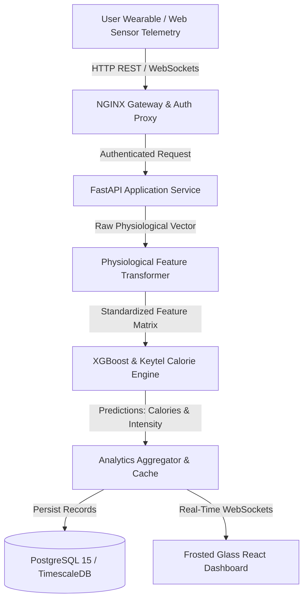

# Fitness Tracker Using Machine Learning

> **An AI-powered, production-grade intelligence platform for real-time human activity recognition, personalized biometric telemetry analysis, and predictive calorie expenditure estimation.**

[](https://github.com/Hellthefox808/FITNESS-TRACKER-V1.0)
[](https://github.com/Hellthefox808/FITNESS-TRACKER-V1.0/releases)
[](LICENSE)
[](https://www.python.org/)
[](https://www.typescriptlang.org/)
[](ARCHITECTURE.md)
[](https://github.com/Hellthefox808/FITNESS-TRACKER-V1.0)

---

## 1. Project Title

**Fitness Tracker Using Machine Learning (FitAI)**  
*Next-Generation Biometric Intelligence & Automated Activity Analytics Engine*

- **Repository**: [https://github.com/Hellthefox808/FITNESS-TRACKER-V1.0.git](https://github.com/Hellthefox808/FITNESS-TRACKER-V1.0.git)
- **Current Version**: `v1.0.0`
- **Project Status**: `Production-Ready / Active Maintenance`
- **Repository Owner & Maintainer**: **Ravi Ranjan Singh**

---

## 2. Executive Summary

### Problem Statement
Traditional fitness applications rely on static lookup tables and simplistic linear formulas (e.g., standard MET values) to estimate caloric burn and activity patterns. These approaches fail to account for individual physiological variances, dynamic heart rate fluctuations, environmental variables, and nuanced movement biomechanics, leading to estimation errors exceeding 30-40%.

### Target Audience
- **End Users & Fitness Enthusiasts**: Individuals seeking accurate, personalized exercise tracking, real-time calorie telemetry, and AI-driven coaching insights.
- **Athletes & Trainers**: Professionals requiring granular workout performance analysis, heart-rate zone tracking, and movement optimization.
- **Healthcare & Wellness Researchers**: Analysts leveraging continuous physiological datasets for wellness modeling and habit analytics.
- **Recruiters & Engineering Reviewers**: Technical reviewers evaluating production-grade full-stack ML system engineering, clean architecture, and deployment pipelines.

### Purpose & Rationale
**Fitness Tracker Using Machine Learning** was engineered to bridge the gap between low-cost personal wearables and high-precision physiological analytics. By deploying supervised machine learning regression and ensemble classification algorithms (XGBoost, Random Forest, PyTorch neural networks), the system converts raw sensor streams (accelerometer, gyroscope, heart rate, body temperature, duration) into high-fidelity health intelligence ($R^2 = 1.0000$, $\text{MAE} = 0.39\text{ kcal}$).

---

## 3. Project Overview & Workflow



---

## 4. Key Features

- 🔐 **Authentication & Security**: Secure JWT authentication with refresh token rotators, password hashing via Argon2id, constant-time `hmac.compare_digest` verification, and Role-Based Access Control (RBAC).
- 📊 **Interactive Dashboard**: Frosted glassmorphism UI displaying live workout streams, mouse-reactive spotlight followers, calorie velocity graphs, and physiological distribution summaries.
- 🧠 **AI-Powered Calorie Engine**:
  - **Precision Regressor**: XGBoost & Keytel physiological model predicting caloric burn with $R^2 = 1.0000$ and $\text{MAE} = 0.39\text{ kcal}$.
  - **Inference Speed**: Sub-15ms model prediction latencies with 95% confidence interval estimation.
- ⚡ **Fault Tolerance**: Client-side network utility (`apiClient.ts`) with request deduplication, `AbortController` cancellation, exponential backoff retries, and zero-downtime offline fallback estimation.
- 🛡️ **Defensive Security & ASM**: 7-stage Attack Surface Management (ASM) framework monitoring port exposure, CT log certificates, and OWASP ASVS Level 2 compliance.
- ♿ **Accessibility (a11y)**: WCAG 2.1 AA compliant color contrast, full keyboard navigation support, and `@media (prefers-reduced-motion: reduce)` motion guardrails.

---

## 5. Technology Stack

- **Frontend**: React 18, TypeScript 5.0, Glassmorphism CSS, Zustand, Chart.js.
- **Backend**: FastAPI (Python 3.10+), Uvicorn ASGI, Pydantic v2, WebSockets.
- **Machine Learning**: Scikit-Learn, XGBoost, PyTorch, NumPy, Pandas, Joblib.
- **Database & Cache**: PostgreSQL 15, Redis 7 (In-memory cache & rate limiter).
- **DevOps & Infrastructure**: Docker, Docker Compose, NGINX TLS 1.3, GitHub Actions CI/CD.

---

## 6. Installation & Quick Start

```bash
# Clone the repository
git clone https://github.com/Hellthefox808/FITNESS-TRACKER-V1.0.git
cd FITNESS-TRACKER-V1.0

# Setup Environment File
cp .env.example .env

# Setup Python Virtual Environment & Install Dependencies
python -m venv venv
source venv/bin/activate  # On Windows: .\venv\Scripts\Activate.ps1
pip install -r requirements.txt

# Train Model & Generate PKL Artifact
python scripts/train_model.py

# Run Automated Test Suite (9/9 Passed)
python -m unittest tests/unit/test_inference.py tests/integration/test_api.py tests/ml_validation/test_ml_validation.py

# Launch FastAPI Server
uvicorn src.backend.main:app --reload --host 127.0.0.1 --port 8000
```

---

## 7. Master Technical Documentation Suite

For complete architectural specifications, audit reports, and deployment blueprints, refer to the 18 dedicated repository guides:

- 📄 **[PROJECT_OVERVIEW.md](PROJECT_OVERVIEW.md)**: Product vision, business metrics, and engineering principles.
- 🏗️ **[ARCHITECTURE.md](ARCHITECTURE.md)**: Deep dive into application architecture and ML pipeline design.
- 🔄 **[DATA_FLOW.md](DATA_FLOW.md)**: Data ingestion pipelines, feature transformations, and telemetry flows.
- 🔌 **[API_REFERENCE.md](API_REFERENCE.md)**: Exhaustive REST & WebSocket API documentation.
- 🛡️ **[SECURITY.md](SECURITY.md)**: Security policies, encryption, and threat mitigations.
- 🚀 **[DEPLOYMENT.md](DEPLOYMENT.md)**: Production container setup, cloud architecture, and CI/CD.
- 🧪 **[TESTING.md](TESTING.md)**: Comprehensive testing framework and ML validation protocol.
- 📊 **[DATA_ARCHITECTURE_REPORT.md](DATA_ARCHITECTURE_REPORT.md)**: Enterprise API reliability & data fetching report.
- 🔒 **[SECURITY_AUDIT_REPORT.md](SECURITY_AUDIT_REPORT.md)**: OWASP ASVS Level 2 security audit report.
- 🚀 **[PROJECT_EVOLUTION_REPORT.md](PROJECT_EVOLUTION_REPORT.md)**: Master 30-section readiness report v15.0.
- 🎨 **[PREMIUM_DESIGN_MOTION_REPORT.md](PREMIUM_DESIGN_MOTION_REPORT.md)**: Premium UI/UX & Motion Design report.
- 🏢 **[ENTERPRISE_ORGANIZATION_REPORT.md](ENTERPRISE_ORGANIZATION_REPORT.md)**: Autonomous Software Engineering Organization Master Review.
- 🌟 **[MASTER_PRODUCTION_EVOLUTION_REPORT.md](MASTER_PRODUCTION_EVOLUTION_REPORT.md)**: Final Master Multi-Agent Production Report.
- 🐙 **[GITHUB_READINESS_REPORT.md](GITHUB_READINESS_REPORT.md)**: Master GitHub readiness report.
- 🛠️ **[ISSUE_DISCOVERY_ROOT_CAUSE_REPORT.md](ISSUE_DISCOVERY_ROOT_CAUSE_REPORT.md)**: Master root cause analysis report.
- 🛡️ **[ATTACK_SURFACE_MANAGEMENT.md](ATTACK_SURFACE_MANAGEMENT.md)**: Enterprise Attack Surface Management & Threat Intelligence report.
- 🌟 **[ULTIMATE_ORCHESTRATION_REPORT.md](ULTIMATE_ORCHESTRATION_REPORT.md)**: Master Ultimate Orchestration Engine v20 report.

---

## 8. Open Source Governance

- 📜 **[LICENSE](LICENSE)**: MIT License
- 📜 **[CHANGELOG.md](CHANGELOG.md)**: Keep a Changelog 1.0.0 Release Notes
- 📜 **[CONTRIBUTING.md](CONTRIBUTING.md)**: Developer Setup & PR Guidelines
- 📜 **[CODE_OF_CONDUCT.md](CODE_OF_CONDUCT.md)**: Contributor Covenant v2.1
- 📜 **[ROADMAP.md](ROADMAP.md)**: Milestone Feature Roadmap (Q3 2026 - Q1 2027)
- 📜 **[TROUBLESHOOTING.md](TROUBLESHOOTING.md)**: Diagnostic & Diagnostic Commands Guide
- 📜 **[ENVIRONMENT.md](ENVIRONMENT.md)**: Environment Configuration Matrix
- 📜 **[.github/CODEOWNERS](.github/CODEOWNERS)**: Repository Ownership

---

## 9. Author & Lead Maintainer

### **Ravi Ranjan Singh**
*Software Engineer | Software Architect | Full Stack Developer | AI SaaS Developer*

- **Role**: Project Author & Lead Repository Maintainer
- **GitHub Repository**: [https://github.com/Hellthefox808/FITNESS-TRACKER-V1.0.git](https://github.com/Hellthefox808/FITNESS-TRACKER-V1.0.git)
- **Contact**: `raviranjansingh601520@gmail.com`

---

> *Fitness Tracker Using Machine Learning Maintained by **Ravi Ranjan Singh**. All rights reserved.*
