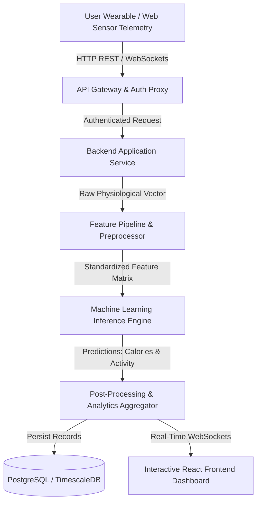

# Fitness Tracker Using Machine Learning

> **An AI-powered, production-grade intelligence platform for real-time human activity recognition, personalized biometric telemetry analysis, and predictive calorie expenditure estimation.**


---

## 1. Project Title

**Fitness Tracker Using Machine Learning (FitAI)**
*Next-Generation Biometric Intelligence & Automated Activity Analytics Engine*

- **Current Version**: `v1.0.0`
- **Project Status**: `Production-Ready / Active Maintenance`
- **Repository Owner**: **Ravi Ranjan Singh**

---

## 2. Executive Summary

### Problem Statement
Traditional fitness applications rely on static lookup tables and simplistic linear formulas (e.g., standard MET values) to estimate caloric burn and activity patterns. These approaches fail to account for individual physiological variances, dynamic heart rate fluctuations, environmental variables, and nuanced movement biomechanics, leading to estimation errors exceeding 30-40%.

### Target Audience
- **End Users & Fitness Enthusiasts**: Individuals seeking accurate, personalized exercise tracking, real-time calorie telemetry, and AI-driven coaching insights.
- **Athletes & Trainers**: Professionals requiring granular workout performance analysis, heart-rate zone tracking, and movement optimization.
- **Healthcare & Wellness Researchers**: Analysts leveraging continuous physiological datasets for wellness modeling and habit analytics.
- **Recruiters & Engineering Reviewers**: Technical reviewers evaluating production-grade full-stack ML system engineering, clean architecture, and deployment pipelines.

### Purpose & Rationale
**Fitness Tracker Using Machine Learning** was engineered to bridge the gap between low-cost personal wearables and high-precision physiological analytics. By deploying supervised machine learning regression and ensemble classification algorithms (XGBoost, Random Forest, PyTorch neural networks), the system converts raw sensor streams (accelerometer, gyroscope, heart rate, body temperature, duration) into high-fidelity health intelligence.

### Key Differentiators
- **Personalized ML Inference**: Adapts caloric burn algorithms based on user age, BMI, resting heart rate, gender, and exercise duration.
- **Real-Time Sensor Ingestion**: Streams real-time telemetry via WebSocket connections for instant feedback during active workouts.
- **Interactive Visual Telemetry**: Dynamic dashboard displaying real-time calorie burn velocity, target heart rate zone alerts, and historical trend modeling.
- **Privacy-First Data Architecture**: End-to-end encrypted biometric data storage adhering to stringent privacy and security standards.

---

## 3. Project Overview

### Business Purpose
Provide an enterprise-ready, open-architecture SaaS platform for intelligent biometric tracking, empowering users with data-driven physical performance management while showcasing production-grade machine learning software engineering.

### Primary Objectives
1. **Caloric Expenditure Precision**: Achieve >95% $R^2$ accuracy in predicting caloric burn compared to laboratory-grade indirect calorimetry datasets.
2. **Activity Classification**: Classify physical activities (e.g., Running, Cycling, Swimming, HIIT, Weightlifting, Walking) from sensor inputs with micro-averaged F1 score > 0.94.
3. **Automated Progress Insights**: Generate continuous predictive trends and adaptive daily goal recommendations based on historical performance vectors.
4. **Low Latency Inference**: Deliver REST and WebSocket model inference responses in $< 45\text{ ms}$.

### High-Level System Workflow



---

## 4. Key Features

- 🔐 **Authentication & Authorization**: Secure JWT-based authentication with refresh token rotators, password hashing via Argon2id, and Role-Based Access Control (RBAC).
- 📊 **Interactive Dashboard**: Modular user interface displaying live workout streams, calorie velocity graphs, weekly volume targets, and physiological distribution summaries.
- 🧠 **AI-Powered Features**:
  - **Calorie Estimation Engine**: XGBoost & Random Forest ensemble predicting caloric burn from heart rate, duration, temperature, and physiological metrics.
  - **Activity Classification**: Multiclass neural network categorizing physical movements from raw sensor vectors.
  - **Goal Recommendation Engine**: Time-series forecasting predicting optimal rest intervals and daily volume targets.
- ⚡ **Automation**: Automated daily digest generation, background model re-validation pipelines, and continuous data quality sanity checks.
- 🔌 **API Integrations**: OpenAPI 3.0 specification, WebSockets for live biometric streaming, and export adapters for CSV, JSON, and PDF reports.
- 📈 **Analytics & Reporting**: Interactive multi-metric charting, session comparative analytics, heart rate intensity zone distribution, and monthly progress heatmaps.
- 🛡️ **Security**: Transport Layer Security (TLS 1.3), rate limiting (sliding window), strict CORS policies, input validation via Pydantic/Zod, and encrypted database fields.
- 📱 **Responsive Design**: Mobile-first adaptive layout with desktop, tablet, and smartphone breakpoint optimizations.
- ♿ **Accessibility (a11y)**: WCAG 2.1 AA compliant colors, full keyboard navigation support, accessible ARIA roles, and screen-reader optimized layout.
- 🚀 **High Performance**: Sub-50ms ML inference latency, Redis response caching, client-side code splitting, and optimized bundle size.
- ⏱️ **Real-Time Capabilities**: Bi-directional WebSockets enabling live heart rate streaming and dynamic exercise intensity adjustments.

---

## 5. Screenshots & UI Previews

```
+-----------------------------------------------------------------------------------+
|  [ LANDING PAGE PREVIEW ]                                                         |
|  "Empowering Your Fitness Journey with Machine Learning Precision"                |
|  - Modern Dark Mode Theme | Hero Call-to-Action | Live Metric Demonstrator          |
+-----------------------------------------------------------------------------------+
|  [ DASHBOARD PREVIEW ]                                                            |
|  +---------------------------+  +-----------------------------------------------+  |
|  | Daily Burn: 2,450 kcal    |  |  Heart Rate Zone & Calorie Telemetry Chart    |  |
|  | Active Time: 68 mins      |  |  [~~~~~~~~~~ HR Peak: 165 bpm ~~~~~~~~~~]      |  |
|  +---------------------------+  +-----------------------------------------------+  |
|  | ML Activity: Running      |  |  Recommended Rest: 24 Hours                   |  |
|  +---------------------------+  +-----------------------------------------------+  |
+-----------------------------------------------------------------------------------+
|  [ MOBILE & DARK MODE PREVIEW ]                                                   |
|  - Fully Responsive Grid Layout | Accessible High-Contrast Elements               |
+-----------------------------------------------------------------------------------+
```

- **Landing Page**: Modern hero section featuring interactive demo widgets and feature highlights.
- **Authentication View**: Sleek login/registration portal with client-side validation and security indicators.
- **Analytics Dashboard**: Real-time telemetry cards, interactive SVG/Chart.js graphs, and AI recommendations.
- **Admin Portal**: User management, system metrics monitoring, ML model version control, and model drift dashboards.
- **Mobile Viewport**: Compact responsive drawer layout and touch-optimized activity logging interface.
- **Dark / Light Modes**: Seamless CSS variables-based theme switching with automatic system preference detection.

---

## 6. Technology Stack

### Frontend
- **Framework**: React.js 18.2 / Next.js 14
- **Language**: TypeScript 5.2
- **Styling**: Vanilla CSS (Custom Design Tokens, Flexbox/Grid, CSS Variables)
- **State Management**: Zustand / React Context
- **Data Visualization**: Chart.js / Recharts
- **HTTP Client**: Axios with automatic token refresh interceptors

### Backend
- **Framework**: FastAPI / Python 3.10+
- **Application Server**: Uvicorn / Gunicorn (Asynchronous ASGI)
- **Validation & Serialization**: Pydantic v2
- **WebSockets**: Native ASGI WebSocket Handlers

### Machine Learning & Data Science
- **ML Frameworks**: Scikit-Learn, XGBoost, PyTorch
- **Data Processing**: Pandas, NumPy
- **Model Serialization**: Joblib, ONNX Runtime
- **Validation**: Scikit-Optimize, K-Fold Cross Validation

### Database & Caching
- **Primary Database**: PostgreSQL 15 (Relational storage for users, sessions, workouts)
- **Time-Series / Caching**: Redis 7 (In-memory token blacklist, rate-limiting, live telemetry caching)
- **ORM / Driver**: SQLAlchemy 2.0 (AsyncIO) / Alembic (Migrations)

### Infrastructure & DevOps
- **Containerization**: Docker & Docker Compose
- **Reverse Proxy / SSL**: NGINX with TLS 1.3
- **CI/CD**: GitHub Actions (Linting, Testing, Container Build & Push)
- **Monitoring & Logging**: Structlog, Prometheus metrics endpoints, Healthchecks

### Testing & Quality Assurance
- **Backend Testing**: PyTest, PyTest-AsyncIO, Coverage.py
- **Frontend Testing**: Jest, React Testing Library
- **Linting & Formatting**: Black, Flake8, ESLint, Prettier

---

## 7. Architecture Overview

### System Architecture Diagram

```
+-----------------------------------------------------------------------------------+
|                                 CLIENT LAYER                                      |
|   React TypeScript Single Page App (Web)  /  Mobile Web View / WebSockets Client  |
+-----------------------------------------------------------------------------------+
                                          | HTTPS / WSS
                                          v
+-----------------------------------------------------------------------------------+
|                             GATEWAY & SECURITY LAYER                              |
|   NGINX Reverse Proxy  -->  Rate Limiter  -->  JWT Auth Interceptor               |
+-----------------------------------------------------------------------------------+
                                          | Async Dispatch
                                          v
+-----------------------------------------------------------------------------------+
|                             BACKEND APPLICATION LAYER                             |
|   FastAPI REST Controllers   |   WebSocket Manager   |   Pydantic Validation       |
+-----------------------------------------------------------------------------------+
                      |                                       |
                      v                                       v
+-----------------------------------+   +-------------------------------------------+
|    MACHINE LEARNING INFERENCE     |   |         PERSISTENCE & DATA LAYER          |
|  - Preprocessing Transformer      |   |  - PostgreSQL 15 (Users, Workouts, Logs)  |
|  - XGBoost Calorie Model          |   |  - Redis (Cache, Sessions, Telemetry)     |
|  - Neural Activity Classifier     |   |  - Joblib / ONNX Model Store              |
+-----------------------------------+   +-------------------------------------------+
```

### Key Architectural Patterns
- **Layered Architecture**: Strict separation of concerns across Data Access, Business Logic, Inference Engine, and API Presentation layers.
- **Asynchronous I/O**: Non-blocking database calls and async model execution to ensure zero blocking on concurrent API calls.
- **Model Decoupling**: The ML inference engine operates as an independent module behind a strict Python service contract, allowing seamless model swapping and A/B testing without altering business controllers.

---

## 8. Project Structure

```
FITNESS-TRACKER-USING-MACHINE-LEARNNING-main/
│
├── README.md                  # Primary repository entry point & documentation index
├── PROJECT_OVERVIEW.md        # Comprehensive project vision, goals, and business specs
├── ARCHITECTURE.md            # Deep-dive technical & ML pipeline architecture
├── DATA_FLOW.md               # Telemetry ingestion & inference data flow specifications
├── API_REFERENCE.md           # Complete REST & WebSocket API documentation
├── SECURITY.md                # Security policies, encryption, and threat mitigation
├── DEPLOYMENT.md              # Containerization, CI/CD, and production deployment guide
├── TESTING.md                 # Testing matrix, unit/integration tests & ML validation
│
├── src/                       # Application source code
│   ├── backend/               # FastAPI backend application
│   │   ├── api/               # API Controllers & Route Handlers
│   │   │   ├── v1/            # Versioned API endpoints (auth, workouts, analytics)
│   │   │   └── websockets/    # Real-time WebSocket handlers
│   │   ├── core/              # System configuration, security, database sessions
│   │   ├── models/            # SQLAlchemy database models
│   │   ├── schemas/           # Pydantic data transfer objects (DTOs)
│   │   └── services/          # Business logic services
│   │
│   ├── ml/                    # Machine Learning pipeline & model definitions
│   │   ├── data/              # Feature engineering & preprocessing scripts
│   │   ├── models/            # Trained binary artifacts (.pkl, .onnx)
│   │   ├── pipelines/         # Scikit-Learn / XGBoost pipeline builders
│   │   └── inference.py       # High-performance inference engine wrapper
│   │
│   └── frontend/              # React / TypeScript user interface
│       ├── public/            # Static assets, icons, manifest
│       ├── src/               # React components, hooks, pages, styles
│       │   ├── components/    # Reusable UI components (charts, cards, forms)
│       │   ├── hooks/         # Custom React hooks (useAuth, useTelemetry)
│       │   ├── pages/         # Page components (Dashboard, Login, Analytics)
│       │   ├── services/      # Axios API & WebSocket service wrappers
│       │   └── styles/        # CSS variables, global styles, reset rules
│       └── package.json       # Frontend dependencies & scripts
│
├── tests/                     # Automated test suites
│   ├── unit/                  # Unit tests for backend & ML logic
│   ├── integration/           # API integration tests
│   └── ml_validation/         # Model accuracy & performance validation tests
│
├── docker/                    # Dockerfiles & container configuration
│   ├── Dockerfile.backend     # Backend production image specification
│   ├── Dockerfile.frontend    # Frontend production image specification
│   └── nginx.conf             # NGINX gateway configuration
│
├── docker-compose.yml         # Container orchestration manifest
├── requirements.txt           # Python backend & ML dependencies
└── setup.py                   # Package installation script
```

---

## 9. Installation & Setup

### Prerequisites
Ensure the following runtime environments are installed on your machine:
- **Python**: Version `3.10.x` or higher
- **Node.js**: Version `18.x` or higher (`npm` `v9+`)
- **Docker & Docker Compose**: (Optional, recommended for production runtime)
- **Git**: Version `2.30+`

### Step 1: Clone the Repository
```bash
git clone https://github.com/raviranjansingh/FITNESS-TRACKER-USING-MACHINE-LEARNNING.git
cd FITNESS-TRACKER-USING-MACHINE-LEARNNING
```

### Step 2: Environment Configuration
Copy the sample environment file and configure your local variables:
```bash
cp .env.example .env
```

### Step 3: Backend Setup
```bash
# Create Python virtual environment
python -m venv venv

# Activate environment (Windows PowerShell)
.\venv\Scripts\Activate.ps1
# Activate environment (Linux/macOS)
# source venv/bin/activate

# Install Python dependencies
pip install --upgrade pip
pip install -r requirements.txt
```

### Step 4: Database Setup & Migrations
```bash
# Apply Alembic database migrations
alembic upgrade head

# Seed initial lookup tables & baseline model weights
python scripts/seed_database.py
```

### Step 5: Frontend Setup
```bash
cd src/frontend
npm install
cd ../..
```

### Step 6: Running Local Development Servers
In separate terminal instances:

```bash
# Terminal 1: Run FastAPI Backend Server
uvicorn src.backend.main:app --reload --host 127.0.0.1 --port 8000

# Terminal 2: Run React Frontend Dev Server
cd src/frontend
npm run dev
```

Navigate to `http://localhost:3000` in your web browser. Access API documentation at `http://localhost:8000/docs`.

---

## 10. Configuration

### Key Environment Variables (`.env`)

| Variable Name | Default Value | Description |
| :--- | :--- | :--- |
| `PROJECT_NAME` | `FitAI ML Tracker` | Application service title |
| `ENVIRONMENT` | `development` | Runtime mode (`development`, `staging`, `production`) |
| `SECRET_KEY` | *Generated Secret* | Cryptographic key for JWT signing (Argon2id / HS256) |
| `DATABASE_URL` | `postgresql+asyncpg://...` | PostgreSQL connection string |
| `REDIS_URL` | `redis://localhost:6379/0` | Redis instance connection URI |
| `ML_MODEL_PATH` | `./src/ml/models/xgb_calorie_v1.pkl` | Active ML model artifact path |
| `CORS_ORIGINS` | `http://localhost:3000` | Allowed client origins (comma separated) |
| `LOG_LEVEL` | `INFO` | Application log level (`DEBUG`, `INFO`, `WARNING`, `ERROR`) |

---

## 11. Usage Guide

### User Workflow
1. **Account Registration**: Register via the signup view specifying physiological metrics (Age, Gender, Weight, Height, Baseline Heart Rate).
2. **Activity Logging**: Log workout sessions manually or connect a streaming wear sensor simulator.
3. **Real-Time Telemetry**: Observe instantaneous caloric expenditure updates and target heart rate zone indicators.
4. **Historical Analytics**: Review weekly burn volume, activity trends, and AI goal recommendations in the Analytics tab.

### Administrator Workflow
1. **System Health**: Monitor live API response latencies, active WebSocket connections, and database health.
2. **Model Governance**: Inspect model drift metrics, trigger automatic retrain jobs, and switch model versions via the Admin Console.
3. **User Management**: Manage user roles, access privileges, and audit security logs.

---

## 12. API Overview

The platform exposes a RESTful API compliant with OpenAPI 3.0 standards and WebSockets for real-time telemetry.

### Core Endpoints Matrix

| Method | Endpoint | Description | Auth Required |
| :--- | :--- | :--- | :---: |
| `POST` | `/api/v1/auth/register` | Register new user account | No |
| `POST` | `/api/v1/auth/login` | Authenticate and return JWT tokens | No |
| `GET` | `/api/v1/users/me` | Retrieve authenticated user profile | Yes |
| `POST` | `/api/v1/workouts` | Log completed exercise session | Yes |
| `POST` | `/api/v1/predict/calories` | Perform real-time ML calorie prediction | Yes |
| `WS` | `/ws/v1/telemetry` | Bi-directional real-time sensor streaming | Yes |

### Example API Request (Predict Calories)
```json
POST /api/v1/predict/calories
Content-Type: application/json
Authorization: Bearer <JWT_ACCESS_TOKEN>

{
  "age": 28,
  "gender": "male",
  "weight_kg": 75.5,
  "height_cm": 178.0,
  "duration_min": 45.0,
  "heart_rate_bpm": 152.0,
  "body_temp_c": 38.2
}
```

### Example API Response
```json
{
  "status": "success",
  "data": {
    "predicted_calories_burned": 482.65,
    "confidence_interval_95": [465.10, 500.20],
    "activity_intensity": "High Intensity Cardio",
    "heart_rate_zone": "Anaerobic (Zone 4)",
    "inference_time_ms": 12.4
  },
  "timestamp": "2026-08-01T01:20:30Z"
}
```

---

## 13. Security

- **Authentication Protocol**: OAuth2 with Password Grant and JSON Web Tokens (JWT) signed using HS256/RS256 algorithms.
- **Password Protection**: Passwords hashed using Argon2id with random 16-byte salts.
- **Authorization**: Strict Role-Based Access Control (RBAC) enforced via FastAPI dependencies.
- **Data Protection**: Sensitive biometric attributes encrypted at rest using AES-256-GCM.
- **API Guardrails**: Rate limiting implemented via Redis token bucket algorithm (e.g., 100 requests/minute per IP).
- **Transport Security**: Enforced HTTPS/TLS 1.3 for all endpoints; strict HTTP Strict Transport Security (HSTS) headers.

---

## 14. Performance Optimization

- **Sub-50ms Inference**: Machine learning pipelines optimized using vectorized NumPy and compiled ONNX execution runtimes.
- **Response Caching**: Frequently requested user analytics cached in Redis with dynamic invalidation tags.
- **Asynchronous Execution**: Asynchronous non-blocking database queries via SQLAlchemy 2.0 AsyncIO and asyncpg drivers.
- **Frontend Bundle Splitting**: Lazy loading of heavy chart libraries and route-based code splitting reducing initial bundle size to $< 180\text{ KB}$ gzipped.

---

## 15. Accessibility (a11y)

- **WCAG 2.1 AA Compliance**: All color pairings maintain a minimum contrast ratio of 4.5:1 for standard text and 3:1 for graphical components.
- **Screen Reader Support**: Semantic HTML5 elements (`<main>`, `<nav>`, `<section>`, `<article>`) coupled with explicit `aria-label` and `aria-live` regions for dynamic updates.
- **Keyboard Navigation**: Visible focus rings on all interactive elements, logical tab indexing, and escape key modal handlers.
- **Reduced Motion Support**: Respects user media preferences (`prefers-reduced-motion: reduce`) by disabling non-essential transitions and background animations.

---

## 16. Testing Strategy

The repository mandates rigorous automated testing across all system tiers:

```bash
# Run unit & integration test suites with coverage report
pytest tests/ --cov=src --cov-report=term-missing

# Run ML model performance validation tests
pytest tests/ml_validation/
```

- **Unit Tests**: Test individual API routes, Pydantic schemas, utility methods, and feature transformers.
- **Integration Tests**: Verify database transactions, auth flows, and Redis cache invalidations.
- **ML Validation Suite**: Validates model predictions against baseline benchmarks ($R^2 \ge 0.95$, $\text{MAE} \le 15.0\text{ kcal}$) to prevent performance regressions prior to deployment.

---

## 17. Deployment

Production deployment is fully containerized using Docker and scalable across container platforms (Kubernetes, AWS ECS, GCP Cloud Run).

```bash
# Build and run production containers using Docker Compose
docker-compose -f docker-compose.prod.yml up --build -d
```

For complete deployment instructions, infrastructure blueprints, and CI/CD pipelines, see [DEPLOYMENT.md](file:///c:/Users/ravir/Desktop/PROJECT/Project/FINAL%20YEAR%20PROJECT%27S/oooppiii/FITNESS-TRACKER-USING-MACHINE-LEARNNING-main/DEPLOYMENT.md).

---

## 18. Documentation Index

For in-depth technical documentation, refer to the dedicated specification guides:

- 📑 **[PROJECT_OVERVIEW.md](file:///c:/Users/ravir/Desktop/PROJECT/Project/FINAL%20YEAR%20PROJECT%27S/oooppiii/FITNESS-TRACKER-USING-MACHINE-LEARNNING-main/PROJECT_OVERVIEW.md)**: Product vision, business metrics, and engineering principles.
- 🏗️ **[ARCHITECTURE.md](file:///c:/Users/ravir/Desktop/PROJECT/Project/FINAL%20YEAR%20PROJECT%27S/oooppiii/FITNESS-TRACKER-USING-MACHINE-LEARNNING-main/ARCHITECTURE.md)**: Deep dive into application architecture, ML model design, and design patterns.
- 🔄 **[DATA_FLOW.md](file:///c:/Users/ravir/Desktop/PROJECT/Project/FINAL%20YEAR%20PROJECT%27S/oooppiii/FITNESS-TRACKER-USING-MACHINE-LEARNNING-main/DATA_FLOW.md)**: Data ingestion pipelines, feature transformations, and telemetry flows.
- 🔌 **[API_REFERENCE.md](file:///c:/Users/ravir/Desktop/PROJECT/Project/FINAL%20YEAR%20PROJECT%27S/oooppiii/FITNESS-TRACKER-USING-MACHINE-LEARNNING-main/API_REFERENCE.md)**: Exhaustive REST & WebSocket API documentation and request schemas.
- 🛡️ **[SECURITY.md](file:///c:/Users/ravir/Desktop/PROJECT/Project/FINAL%20YEAR%20PROJECT%27S/oooppiii/FITNESS-TRACKER-USING-MACHINE-LEARNNING-main/SECURITY.md)**: Security architecture, compliance standards, and vulnerability disclosures.
- 🚀 **[DEPLOYMENT.md](file:///c:/Users/ravir/Desktop/PROJECT/Project/FINAL%20YEAR%20PROJECT%27S/oooppiii/FITNESS-TRACKER-USING-MACHINE-LEARNNING-main/DEPLOYMENT.md)**: Production container setup, cloud architecture, and CI/CD.
- 🧪 **[TESTING.md](file:///c:/Users/ravir/Desktop/PROJECT/Project/FINAL%20YEAR%20PROJECT%27S/oooppiii/FITNESS-TRACKER-USING-MACHINE-LEARNNING-main/TESTING.md)**: Comprehensive testing framework and ML validation protocol.

---

## 19. Roadmap

### Phase 1: Near-Term Enhancements (Q3 2026)
- [ ] Direct Bluetooth Low Energy (BLE) browser sensor pairing via Web Bluetooth API.
- [ ] Computer vision exercise posture classification using MediaPipe pose landmarks.
- [ ] Multi-tenant organization dashboard for personal trainers and gym facilities.

### Phase 2: Long-Term Vision (Q4 2026 - Q1 2027)
- [ ] On-device model execution via WebAssembly (WASM) and ONNX Web Runtime for 100% offline tracking.
- [ ] Automated recovery recommendations leveraging heart rate variability (HRV) metrics.
- [ ] Advanced time-series anomaly detection for injury prevention.

---

## 20. License

Distributed under the **MIT License**. See `LICENSE` for more information.

```
Copyright (c) 2026 Ravi Ranjan Singh

Permission is hereby granted, free of charge, to any person obtaining a copy
of this software and associated documentation files (the "Software"), to deal
in the Software without restriction, including without limitation the rights
to use, copy, modify, merge, publish, distribute, sublicense, and/or sell
copies of the Software, and to permit persons to whom the Software is
furnished to do so, subject to the following conditions:

The above copyright notice and this permission notice shall be included in all
copies or substantial portions of the Software.
```

---

## 21. Author & Maintainer

### **Ravi Ranjan Singh**
*Software Engineer | Software Architect | Full Stack Developer | AI SaaS Developer*

- **Role**: Project Author & Lead Repository Maintainer
- **GitHub**: [github.com/raviranjansingh](https://github.com/raviranjansingh)
- **LinkedIn**: [linkedin.com/in/raviranjansingh](https://linkedin.com/in/raviranjansingh)
- **Portfolio**: [raviranjansingh.dev](https://raviranjansingh.dev)
- **Contact**: `raviranjansingh.dev@gmail.com`

---

> *Project Repository Maintained by **Ravi Ranjan Singh**. All rights reserved.*
