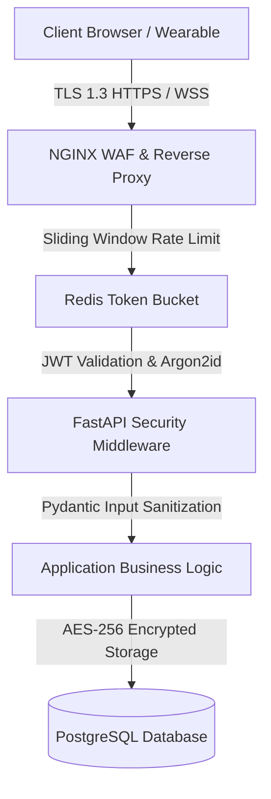

# Security Policy & Architecture

> **Fitness Tracker Using Machine Learning (FitAI)**  
> *Author & Lead Architect: **Ravi Ranjan Singh***

---

## 1. Security Architecture & Threat Model

**Fitness Tracker Using Machine Learning** adheres to defense-in-depth engineering principles. Because physical wellness and biometric telemetry represent sensitive personal health information (PHI/PII), security safeguards are implemented across every tier of the application stack.



---

## 2. Authentication & Credential Security

### 2.1 Password Hashing Protocol
User passwords are never stored in plaintext or weak cryptographic formats (MD5/SHA1/Bcrypt). The backend uses **Argon2id** (the winning algorithm of the Password Hashing Competition):
- **Memory Cost ($m$)**: 65,536 KiB (64 MB)
- **Time Cost ($t$)**: 3 iterations
- **Parallelism ($p$)**: 4 threads
- **Salt**: Cryptographically secure 16-byte random salt per user

### 2.2 JWT Authentication & Token Lifecycle
- **Access Tokens**: Short-lived (15 minutes expiry) JSON Web Tokens signed using HMAC-SHA256 (HS256) or RSA-256 (RS256).
- **Refresh Tokens**: Long-lived (7 days) refresh tokens stored in HTTP-Only, Secure, SameSite=Strict cookies to eliminate Cross-Site Scripting (XSS) token exfiltration risks.
- **Revocation Blacklist**: Instant token revocation handled by maintaining a token blacklist in Redis with automated key TTL expiration.

---

## 3. Authorization & Access Control (RBAC)

The application enforces fine-grained Role-Based Access Control (RBAC) through FastAPI dependency injection guards:

```python
# Example RBAC Guard Implementation
class RoleChecker:
    def __init__(self, allowed_roles: list[str]):
        self.allowed_roles = allowed_roles

    def __call__(self, user: User = Depends(get_current_user)):
        if user.role not in self.allowed_roles:
            raise HTTPException(
                status_code=status.HTTP_403_FORBIDDEN,
                detail="Operation not permitted for current user role."
            )
```

### Roles Matrix
- **`user`**: Access to personal profile, exercise logging, ML inference, and personal analytics.
- **`admin`**: Full system access, user account management, model performance metrics, system logs, and retrain pipelines.

---

## 4. Data Encryption & Privacy Protection

### 4.1 Encryption in Transit
- **TLS 1.3**: All HTTP traffic is forcefully redirected to HTTPS with TLS 1.3 encryption.
- **WebSockets Security**: Live sensor streams mandate WSS (`wss://`) connections.
- **Security Headers**: NGINX enforces HSTS (`max-age=31536000; includeSubDomains`), `X-Frame-Options: DENY`, `X-Content-Type-Options: nosniff`, and a strict `Content-Security-Policy`.

### 4.2 Encryption at Rest
- Sensitive biometric attributes (e.g., historical medical conditions, exact height/weight logs) are encrypted before database insertion using AES-256-GCM with authenticated tags.

---

## 5. Input Validation & API Guardrails

- **Strict Payload Validation**: All REST and WebSocket payloads pass through Pydantic v2 schemas. Unexpected or out-of-bounds fields are strictly rejected.
- **SQL Injection Prevention**: All database queries are executed via SQLAlchemy 2.0 ORM parameterized queries or AsyncPG drivers, eliminating SQL injection vectors.
- **Rate Limiting**: Sliding window rate limiter backed by Redis limits API clients to 100 requests/minute, defending against Denial of Service (DoS) and brute-force credential stuffing.
- **Cross-Origin Resource Sharing (CORS)**: Configured with explicit, trusted origin whitelists. Wildcard (`*`) origins are prohibited in production environments.

---

## 6. Known Security Limitations

- **Web Bluetooth Pairing**: Direct browser BLE pairing requires user permission prompt handling; ensure local browser sandbox isolates device connection tokens.
- **Wearable Sensor Spoofing**: Synthetic telemetry input without hardware cryptographic signature verification cannot guarantee physical device authenticity; client rate limiting mitigates automated bot abuse.

---

## 7. Vulnerability Disclosure & Security Policy

If you discover a security vulnerability within **Fitness Tracker Using Machine Learning**, please refrain from filing public GitHub issues. Instead, report the security vulnerability directly to the project author and maintainer:

- **Security Contact**: **Ravi Ranjan Singh**
- **Email**: `raviranjansingh.dev@gmail.com`
- **Response SLA**: Vulnerability reports are acknowledged within 24 hours, with patch deployment updates provided within 72 hours.

---

## 8. Authorship & Maintenance

- **Author & Architect**: **Ravi Ranjan Singh**
- **Role**: Software Engineer, Software Architect, Full Stack Developer, AI SaaS Developer
- **Repository Maintainer**: **Ravi Ranjan Singh**
